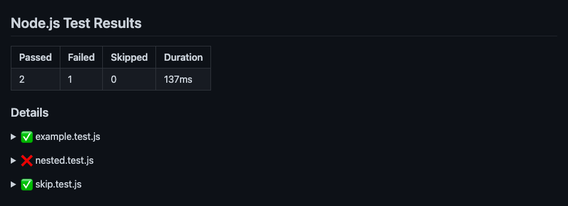
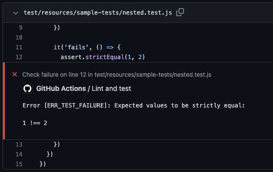

# node-test-github-reporter


A GitHub test reporter for the Node.js test runner





## Installation

```shell
npm i -D node-test-github-reporter
```

## Usage

```shell
node --test --test-reporter node-test-github-reporter
```

You can use it in conjunction with another test report to also get the output in the logs:

```shell
node --test --test-reporter spec --test-reporter-destination stdout --test-reporter node-test-github-reporter --test-reporter-destination stdout
```
